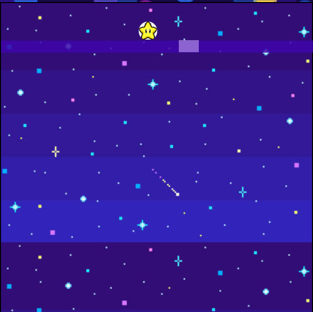
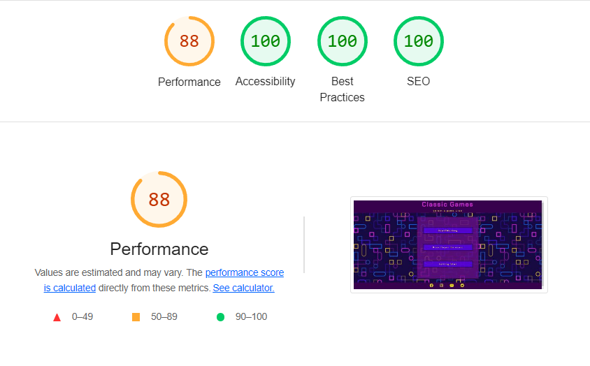
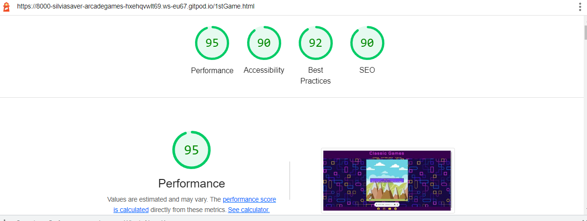
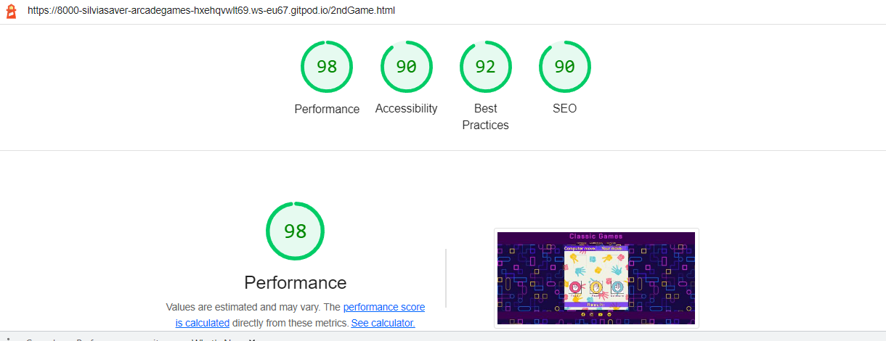
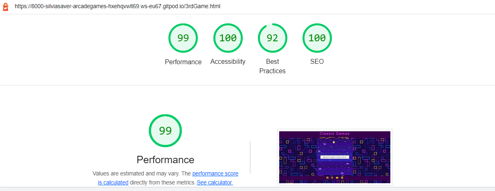
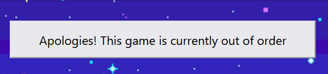

#   M2 project
# Classic Games

##  Strategy/Scope
Classic Games is an entertainment site intended for users that are looking to play and de-stress. The site features three games the user can play with:
- 1)Goat & Monkey
- 2)Rock Paper Scissor 
- 3)Falling star

The site goal is to enjoy playing and have some fun whilst trying any of the games. No scores or level have been added yet.
In each page the user will find a similar layout with playgrounds centred, some instructions showing up and intuitive site interface to navigate the site itself.
Entertaining arcade sound effects and mostly arcade graphic backgrounds on game1 and game3 had been selected to let the user re-experience somehow some nostalgic feelings. 
The style of game2 differ a bit to catch the attention of a more younger audience, whilst displaying one of the oldest game ever. 

## Site owner goals

As owner I would like to:

  •	provide entertaining and interactive experience to all users.

  •	provide a link to social platform to recruit more gamers.

  •	to provide a responsive website, ideal for any device out there.

##  User goals

As user I would like to:

•	Navigate easily through the website.

•   Have hints on how to play the game.

•	See clean interface and be able to track progress/score. (coming soon!)

•	Play/pause audio if not interested.

•	Enjoy the game with no challenges and difficult levels.

•	Be able to re-play the game without using "back" button in the browser.

•	Follow developer’s social platforms and users posts too. 

#   User Experience (UX)

##  Colour Scheme
The colour scheme is maintained throughout the website. The body background features a few colors, ranging from yellow,purple,pink,and light-blue and so on. These same palette had been used throughout the whole site.

The main difference the user will notice is about the backgrounds chosen for each game.

- In the first game-Goat&Monkey, a background of mountains had been chosen to set the Goat and the Monkey in a possible real scenario.

 

- In the second game-Rock_Paper_Scissor, a background featuring some player/computer moves had been selected to let the user jump into a rock-paper-scissors world. 
The colour scheme with relaxing shade of blue, pink and yellow, is constant throughout the game.

 

- In the third game-Falling_Star, a background of a sky at night had been chosen to set the star character in a ‘’real’’ scenario too. 
The user will experience a shade of purple and blue with some dots of white and yellow, recreating the starts and satellites and planets of this arcade universe.

##  Typography

The font that had been used in the website is:
- Chakra Petch
with a fall back of Sans serif and Helvetica.

The above primary font had been selected from the vast catalog offered by [Google font](https://fonts.google.com/); I've found its resemblance to arcade games fonts used back in the 80s and 90s to be a good fit for this website.

#  Structure
## Homepage:

The site homepage besides the logo and the footer, features a small selection of games the user can choose from.

Displayed centrally on the screen and with a color palette of pinks, purples and yellows to increase visibility contrast with the background.

## 1st Game - Goat & Monkey:

By clicking on the first game option the user will have the possibility to play an interpretation of the classic game developed by Google [Dinosaur Game](https://en.wikipedia.org/wiki/Dinosaur_Game).

- The user will be able to control the character:
a simple goat

by left-clicking on the mouse, to let it jump and avoid the obstacle, in this scenario: a monkey on an electric-scooter.

- The game won't start until the user will click on the start button that appears centrally on the playground as soon as the game is opened.

- In the possible instance that the player won't be quick enought to avoid the monkey, a collision will happen and the game will be over. Yet, the user will be able to choose to play again by clicking on the button that appears after collision.

- Should the user decide that she/he would like to play a different game, a simple nav bar had been provided in the header, to let the user easily navigate the website. Links will change depending on which game the user will be playing.

## 2nd Game - Rock, Paper, Scissors:

A real classic of rock, paper, scissors game displaying relaxing colors and image of hands gestures (used in the game itself) in the background.

Here the user will be able to pick one of three possible options, displayed in a row, next to each other, and featuring the classic moves a player could play in this version of the game.
(FUN FACT: in other versions, mainly the french one, the player of rock-paper-scissors can pick up to 5 hand gestures - follow this [Link](https://en.wikipedia.org/wiki/Rock_paper_scissors) to discover more!)

- The game will start as soon as the user will pick an option, letting automatically the computer choose its.

- Results will be displayed at the bottom of the playground, stating either of the three possible outcomes
 - 1) Draw

 

 - 2) User win

 

 - 3) User lose

 

 In this version of the game, the user will be able to play as much as she/he wants.
 In future versions, this game will feature a score section to display who is actually winning in a long run...

 ## 3rd Game - Falling Star

 Another reinterpretation (in terms of graphic) of a classic game. This version features as a character a little yellow start

 

 Set in a background featuring a starred universe

 

 The player will have to move either left or right to let the start falling on the ''pavement'' underneath , by using the ''holes'' in the pavement itself. A visual colour difference will help the player identify the hole and goint towards that direction.

 

 - The game will end when the star will touch the top of the playground; if and when the user won't be fast enough to let its star fall down below, as the walls will be moving upwards towards the playground top. 
 The 'Game over-play again' option will pop up should this happen.

## Visual and audio

The different backgrounds used in this website should please the users and deliver a positive visual response.

The three different soundtracks chosen and assign to the three games, should be catchy enough to let the user continue its positive experience. An option of pausing the music, or play without volue had been provided should the user prefers this way.

## Footer

The footer had been kept simple and easy to locate. By maintaining the same colour palette used in the whole site; it displays favicon of the most knowns social platforms.

The idea behind this is to create a sense of community where players can post about their scores (-to be added in future versions of each games-) and overall to stay up-to-date with new games release.

# *Technologies Used*
Many sites had been helping me clarify concepts to complete this project. Below a list:
-   [W3Schools](https://www.w3schools.com/)
    - Used to check html, ccs, and js , to have a good layout, style and find solutions to some bugs
-	[Google Fonts](https://fonts.google.com/)
	- Used to obtain the font used in this project
-	[Font Awesome](https://fontawesome.com/)
	- Used to obtain the social media icons used in the footer 
-	[Google Developer Tools](https://developers.google.com/web/tools/chrome-devtools)
    - Used as a primary method of fixing spacing issues, finding bugs, and testing responsiveness across the project.
-	[Bootstrap](https://getbootstrap.com/)
	- Used to find a better layout, alignment of the elements and overall improve responsiveness
-	[GitHub](https://github.com/)
	- Used to store code for the project after being pushed.
-	[Git](https://git-scm.com/)
	- Used for version control by utilising the Gitpod terminal to commit to Git and Push to GitHub.
-	[Gitpod](https://www.gitpod.io/)
	- Used as the development environment.
-	[W3C Markup Validation Service](https://validator.w3.org/) 
	- Used to validate all HTML code written and used in this webpage.
-	[W3C CSS Validation Service](https://jigsaw.w3.org/css-validator/#validate_by_input)
	- Used to validate all CSS code written and used in this webpage.
-	[AmIResponsive](http://ami.responsivedesign.is/)
	- Used to generate responsive image used in README file.

### **Lighthouse**

Lighthouse is a feature of Google Chrome developer tools and is used to assess the performance of the website and its features.

Initially results were showing a performance of just 88% - due to the weight of the audio files chosen for each game.

I've decided that just a single soundtrack in the end should have been enough, and so increase the performance results.

### **HTML and CSS Validation**

After fixing some errors on both testing sites- maynli some typos but also some unnecessary sections in index.html or style elements in style.css , the site eventually passed the W3C Validation.

### **Color Contrast Validator**
The initial color of logo content had poor Contrast Ratio of 3.52 with the background. So I changed it to a darker green and a darker orange, and i've also slightly changed the opacity of the background color. 

The Color Contrast Accessibility Validator was used to test for colour contrast on the project.

### Known Bugs and issues
The third game - Falling Star - is simply out of order. 

Sadly, way too many bug fixing had preventing me to finish with the Javascript code to make it work.

HOWEVER! as this website has been created for learning purposes and to have fun whilst learning how to use Javascript language, and discover other few bits and bots of CSS and HTML, i've come to terms with myself and decided that the grade is not that much of a deal, so I've left the project as it is right now -just a button with an 'out of order message'.

For those of you wondering: I am very proud of what i've achieded so far.

- The music chosen for the games,although still in the audio folder, had been removed, as the site was super-slow and I don't have the right knowledge yet to fix this issue. To the few still reading this file, feel free to play in the background to fully experience what i originally wanted to provide the users with. Enjoy!

#   Credits
##  Code
The content for this website was created by the owner with the only purpose of putting into practice what has been learnt so far in CodeInstitute course.
No games rules in this website is fruit of the owner imagination. Classic versions had been around for a long time. 

##  Acknowledgements
I firstly would like to acknowledge the two youtubers that took their time to post some tutorial online.
I couldn't have done it without studying what was been shown in their videos.
 -Shawn Beaton and his channel 

 [KnifeCircus Youtube channel](https://www.youtube.com/c/KnifeCircus)

 -Ania Kubow and her channel

 [Ania Kubow Youtube channel](https://www.youtube.com/c/AniaKub%C3%B3w)

On a more personal note I will have to offer dinner to many friends of mine:

- First of all my good friend Francesco Rubino, for patiently showing how to fix some bugs and supporting me in the final stage of the project itself.

- My dearest ones Martina and Cosimo for their support and patience.

- The crazy amounts of blogger that took their time to post online tips on how to create some great code.

## Disclaimer
This website is for learning purpose only, and had been created as a second project for Full Stack Coding course of CodeInstitute.