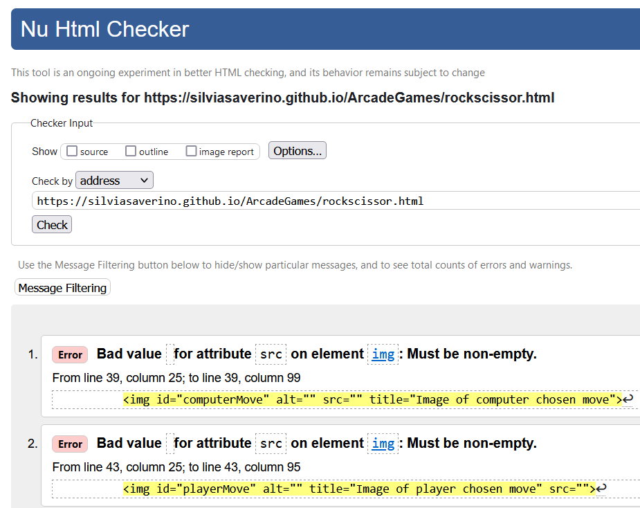

#   M2 project
# Classic Game - Rock Paper Scissors

##  Strategy/Scope
Classic Games is an entertainment site intended for users that are looking to play and de-stress. 

The site feature the classic game
- Rock Paper Scissors
 
The site goal is to enjoy playing and have some fun. No scores or levels have been added in this release.

In each page the user will find a similar layout with playgrounds centered, instructions and an intuitive site interface.

## Site owner goals
 
As owner I would like to:
 
  • provide entertaining and interactive experiences to all users.
 
  • provide a link to social platforms to recruit more gamers.
 
  • to provide a responsive website, ideal for any device out there.
 
 
##  User goals
 
As user I would like to:
 
•   Navigate easily through the website.
 
•   Have clear instructions for how to play the game.
 
•   Enjoy the game with no challenges and difficult levels.
  
•   Follow developer’s social platforms and users' posts too.
 
All of the above bullet points are achieved through a simple website design. A nav bar will help the user navigate easily through the pages. Instructions are provided on a separate page and the user can easily access them without relying on the 'back' button of the browser. Also social platform links are displayed in the footer, to allow the community to connect, and the user to follow the websites social media accounts.

#   User Experience (UX)
 
##  Colour Scheme

The color scheme is maintained on each page of the website. The body background features a few colors, ranging from yellow,purple,pink,and light-blue and so on. This same palette had been used for different elements.
 

In Rock_Paper_Scissors game, a background featuring some player/computer moves had been selected to let the user jump into a rock-paper-scissors world.
The color scheme with relaxing shades of blue, pink and yellow, is constant throughout the game.
 

 
##  Typography
 
The font that had been used in the website is:
- Chakra Petch, with a fall back of Sans serif and Helvetica.
 
The primary font had been selected from the vast catalog offered by [Google font](https://fonts.google.com/) because of its resemblance to arcade games fonts used back in the 80s and 90s.
 

 

#  Structure

## Homepage:
 
The site homepage besides the logo and the footer, features a centered box with two buttons linked respectively to the instructions and the game page.
 
Displayed centrally on the screen and with a color palette of pinks, purples and yellows to increase visibility contrast with the background.
 

 

## Game - Rock, Paper, Scissors:
 
A real classic of rock, paper, scissors game displaying relaxing colors and image of hands gestures (used in the game itself) in the background.
 

 

Here the user will be able to pick one of the three possible options representing the classic moves a player could play in this version of the game.

(FUN FACT: in other versions, mainly the french one, the player of rock-paper-scissors can pick up to 5 hand gestures - follow this [Link](https://en.wikipedia.org/wiki/Rock_paper_scissors) to discover more!)
 

 

- The game will start as soon as the user will pick an option, and let the computer choose its move.
 

 

 

- Results will be displayed at the bottom of the playground, showing one of the three possible outcomes:

 - 1) Draw

  
 
 - 2) User win

  
 
 - 3) User lose

  
 
 In this first game release, the user will be able to play as much as she/he wants.
 In future releases, this game will feature a score section to show who is actually winning in the long run.

## Instructions page

This page simply explains to first time players the rules of the game and the instructions on how to play it.

The colour palette used fot the whole website had been mainteined in this page too. Primary colours are: purple for the background and a shade of yellow for the text paragraph. This contrast allows user readability.

## Navigation bar

A simple navigation bar had been provided on the different website pages, to allow the users to easily navigate the website, with the option to go back to the home page or go to the instructions page, or the game page accordingly to the user visited page.

 
## Footer
 
The footer had been kept simple and easy to locate. It displays favicons of the most known social platforms.
 

 
The idea behind this is to create a sense of community where players can share their thoughts and stay up-to-date with new games release.

 
# *Technologies Used*
I've checked a few websites and additional external sources to complete this project. See below:

-   [W3Schools](https://www.w3schools.com/)
    - Used to check html, ccs, and js , to have a good layout, style and find solutions to some bugs
-   [Google Fonts](https://fonts.google.com/)
    - Used to obtain the font used in this project
-   [Font Awesome](https://fontawesome.com/)
    - Used to obtain the social media icons used in the footer
-   [Google Developer Tools](https://developers.google.com/web/tools/chrome-devtools)
    - Used as a primary method of fixing spacing issues, finding bugs, and testing responsiveness across the project.
-   [Bootstrap](https://getbootstrap.com/)
    - Used to find a better layout, alignment of the elements and overall improve responsiveness
-   [GitHub](https://github.com/)
    - Used to store code for the project after being pushed.
-   [Git](https://git-scm.com/)
    - Used for version control by utilizing the Gitpod terminal to commit to Git and Push to GitHub.
-   [Gitpod](https://www.gitpod.io/)
    - Used as the development environment.
-   [W3C Markup Validation Service](https://validator.w3.org/)
    - Used to validate all HTML code written and used in this web page.
-   [W3C CSS Validation Service](https://jigsaw.w3.org/css-validator/#validate_by_input)
    - Used to validate all CSS code written and used in this web page.
-   [AmIResponsive](http://ami.responsivedesign.is/)
    - Used to check how responsive the site is across different devices.
 
### **Lighthouse**
 
Lighthouse is a feature of Google Chrome developer tools and is used to assess the performance of the website and its features.

Below the positive results for this website.

 
### **HTML and CSS Validation**
 
After fixing some errors on both testing sites- mainly some typos but also some unnecessary sections in index.html or style elements in style.css , the site eventually passed the W3C Validation.
 

 

 
 
### **Color Contrast Validator**
The initial color of logo content had a poor Contrast Ratio of 3.52 with the background. So I changed it to a darker shade of the same colour, and I've also slightly changed the opacity of the background color.
 
The Color Contrast Accessibility Validator was used to test for color contrast on the project.

 
### Known Bugs and issues
 
- There are two empty 'src' attributes in the file rockscissor html. The image had been uploaded through the css file

# Deployment

I follow these steps to deploy my project.
- Log in to GitHub 
- Locate your GitHub repository page
- Find the 'Settings' icon anc click on it
- Once in the settings page, click on the 'Pages' menu item. It should be under 'Code and automation' section
- In the 'Pages' page, under 'Source', select 'Branch:main', then '/root' and click save

The site will be published within minutes.

## Forking the GitHub repository

To view and edit the code without affecting the original repository: 

- Locate the GitHub repository. 
- Click on Fork, in the top right-hand corner.
- Click on the small down arrow Select '+ Create a new fork' 
- This will take you to your own repository to a fork with the same name as the original branch.
- Rename repository
- Click 'Create Fork'

## Creating a local clone of your project

To clone your repository follow the following steps:

- Go to the GitHub repository. 
- Click on Code to the right of the screen, click on HTTPs and copy the link. 
- Open Git Bash and change the current working directory to the location where you want the cloned directory. 
- Type git clone, paste the URL you copied earlier, and press Enter to create your local clone.

#   Credits
##  Code
The content for this website was created by the owner to practice the Javascript module of CodeInstitute course.
No game rules on this website are fruit of the owner's imagination. Classic versions had been around for a long time.
 
##  Acknowledgements
I would like to acknowledge the youtuber that took her time to post some tutorials online.
I couldn't have done it without studying what was shown in those videos.

 -Ania Kubow and her channel
 
 [Ania Kubow Youtube channel](https://www.youtube.com/c/AniaKub%C3%B3w)
 
On a more personal note I would like to thank some friends of mine:
 
- My good friend Francesco Rubino, for patiently showing me how to fix some bugs and supporting me in the final stage of the project itself.
 
- My dearest ones Martina and Cosimo for their support and patience.
 
- Harry Dillon from CodeInstitute who helped me figure out how to fix a few things.
 
## Disclaimer
This website is for learning purposes only, and was created as a second project for the Full Stack Coding course of CodeInstitute.

